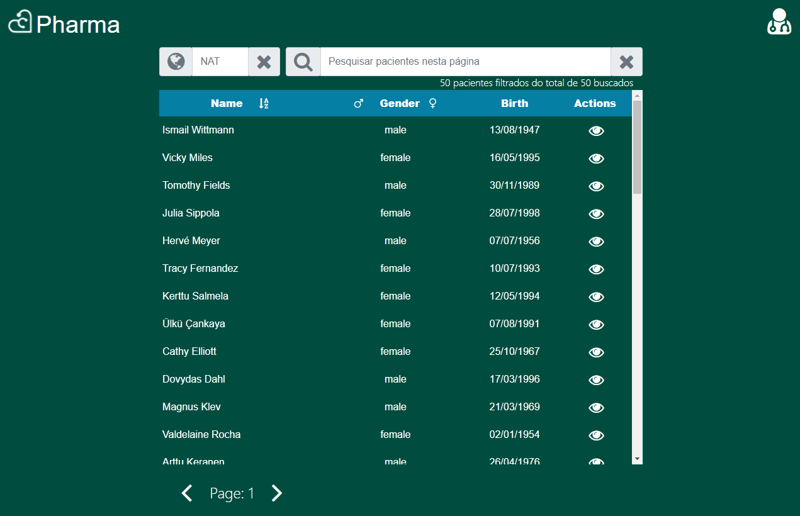

<h1 align="center">
    
</h1>
<h1 align="center">
    
</h1>


## Front-End Challenge by Coodesh 🏅 2021 - Pesquisa de Pacientes
- Projeto desenvolvido como teste de capacitação para a **Coodesh**.
---
## 🩺Descrição
Aplicativo feito para buscar pacientes e seus dados, numa consulta com vários filtros, utilizado a API [https://randomuser.me/api/](https://randomuser.me/)

---

## 💻 Tecnologias utilizadas nesse projeto

- VueJS
- Vuex
- Axios
- BootstrapVue

---

## 📦 Como baixar e instalar o projeto
```bash
# Clonar repositório
$ git clone https://github.com/fred512/pharma

# Entrar no diretório
$ cd\pharma

# Instalar as dependências
$ npm install

# Executar o projeto 
$ npm run serve
```
---

## Utilizando o projeto🏃🏼‍♂️🏃🏼‍♂️🏃🏼‍♂️ 
- No carregamento a 1ª solicitação é feita automaticamente carregando os primeiros 50 pacientes.
- Feito o carregamento, para procurar um paciente pode digitar seu nome no campo "Pesquisar pacientes nesta página". Depois clicar na 🔍Lupa para efetivar a pesquisa.
en- Para limpar essa pesquisa, clicar no botão ✖ do campo "Pesquisar pacientes nesta página", então todos os pacientes serão exibidos novamente.
- Se quiser buscar pacientes de um pais específico, preencha o campo "NAT" com a sigla do país desejado. Depois clicar no botão 🌍mundo que a busca será realizada retornando só pacientes do país selecionado. Quando não existem resultados para o país digitado a tabela não sofre alteração nenhuma, pois a API desconsidera o país sem pacientes e retorna como se não fosse especificado um país.
- Para avançar na pesquisa, clique na ▶ seta abaixo da tabela de resultados. Serão carregados mais 50 pacientes para consulta.
- Para retornar na pesquisa, clique na ◀ seta abaixo da tabela de resultados. Serão carregados os 50 pacientes anteriores para consulta.
- Se quiser ver detalhes de um paciente clique no ícone de 👁 visão na linha do paciente. Será exibido uma janela com os dados do paciente. Para sair do detalhamento, clique no botão ❌ acima à direita da janela.
- Para ordenar a tabela por nome de paciente clique no ícone de ordenamento no cabeçalho da tabela, ao lado da palavra **Name**. Os pacientes serão listados em ordem alfabética crescente. Ao clicar neste ícone novamente a ordenação será decrescente.
- Para filtrar os pacientes na página por sexo, clique no ícone masculino ou feminino. Para cancelar esse filtro clique na palavra **Gender**.

--- 
Projeto foi desenvolvido por \
👨🏻‍🎓 Carlos Frederico de Mendonca Borges\
📧 fredborges512@gmail.com
